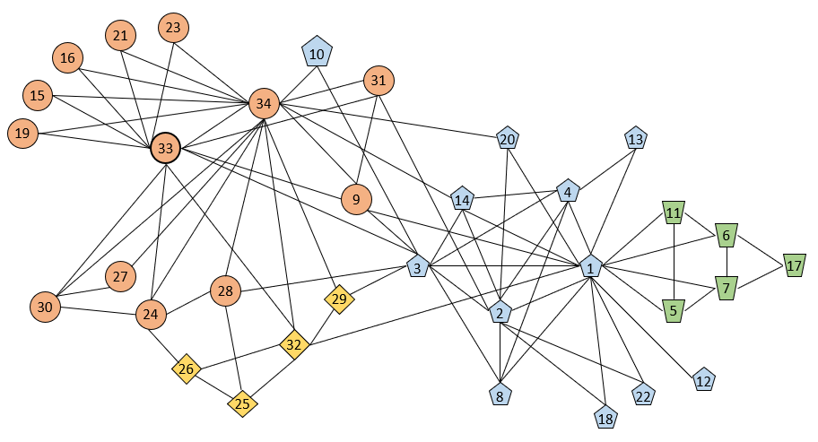

# cuGraph Community Algorithms

```{toctree}
:maxdepth: 1
:hidden:

./louvain_community
./leiden_community
./spectral_clustering
./subgraph_extraction
./triangle_counting
./k_truss
```



The RAPIDS cuGraph Community folder contains a collection of Jupyter Notebooks that demonstrate algorithms to identify clusters or communities that are tightly related within the structure of the graph.  In the diagram above, the color-encoded communities are determined my maximizing [modularity](https://en.wikipedia.org/wiki/Modularity_(networks)) and are likely answers to questions like:

* What communities(clusters) within the graph have the most internal interaction but less external interaction?
* How many and what size are the communities within the graph?
* How strongly are they connected?
* Are there overlapping communities?

Different algorithms work faster and better on different graphs (directed, weighted, sparse)? New notebooks are being created and available [here](https://github.com/rapidsai/notebooks-extended)

## Summary

|Algorithm          |Notebooks Containing                                                     |Description                                                  |
| --------------- | ------------------------------------------------------------ | ------------------------------------------------------------ |
|Louvain Community| [Louvain and Leiden](https://github.com/rapidsai/cugraph/blob/main/notebooks/algorithms/community/Louvain.ipynb)                  |Extracts clusters based on comparing existing edges to a random distribution|
|Leiden Community|[Louvain and Leiden](https://github.com/rapidsai/cugraph/blob/main/notebooks/algorithms/community/Louvain.ipynb)                    |Efficiency improvement over Louvain that creates connected clusters only|
|Spectral Clustering|[Spectral Clustering](https://github.com/rapidsai/cugraph/blob/main/notebooks/algorithms/community/Spectral-Clustering.ipynb)|Uses Eigenvectors and Laplacian to cluster graph|
|Subgraph Extraction|[Subgraph-Extraction](https://github.com/rapidsai/cugraph/blob/main/notebooks/algorithms/community/Subgraph-Extraction.ipynb)|Creates a subgraph including all edges of the supplied nodelist|
|Triangle Counting|[Triangle Counting](https://github.com/rapidsai/cugraph/blob/main/notebooks/algorithms/community/Triangle-Counting.ipynb)|Counts the number of fully connected triples in the graph|
|K Truss|[K Truss](https://github.com/rapidsai/cugraph/blob/main/notebooks/algorithms/community/ktruss.ipynb)|Returns the largest relaxed clique (k-truss) in the graph|


## Copyright

Copyright (c) 2019 - 2025, NVIDIA CORPORATION.

Licensed under the Apache License, Version 2.0 (the "License");  you may not use this file except in compliance with the License. You may obtain a copy of the License at http://www.apache.org/licenses/LICENSE-2.0

Unless required by applicable law or agreed to in writing, software distributed under the License is distributed on an "AS IS" BASIS, WITHOUT WARRANTIES OR CONDITIONS OF ANY KIND, either express or implied. See the License for the specific language governing permissions and limitations under the License.