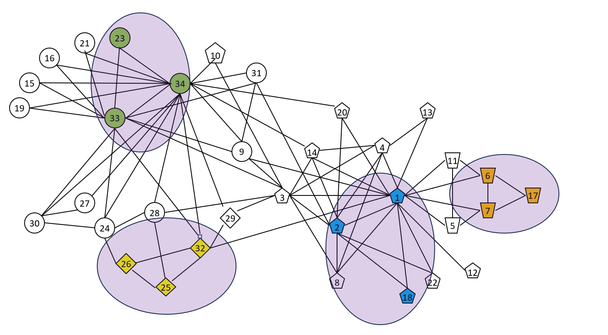

# Triangle Counting

Triangle Counting, as the name implies, finds the number of triangles in a graph. Each triangle is a set of three nodes that are connected to each other. They are important in computing the [Clustering Coefficient](https://en.wikipedia.org/wiki/Clustering_coefficient) and can be used for clustering. In the visualization of the [Zachary Karate Club data](http://www.communicationcache.com/uploads/1/0/8/8/10887248/an_information_flow_model_for_conflict_and_fission_in_small_groups.pdf) above, several of the triangles are highlighted in purple.

$$
    \text{Triangle Count} = \frac{1}{3} \sum_{(u,v) \in E} |N(u) \cap N(v)|
$$

* $N(u)$ - set of neigbors of node $u$
* $N(v)$ - set of neigbors of node $v$
* $|N(u) \cap N(v)$ - intersection of the neigbors of nodes $u$ and $v$ that contain an edge $(u,v)$
* Divide by three to remove triple counting

## When to use Triangle Counting
* 

## When not to use Triangle Counting
* Sparse graphs which don't contain many triangles since it might eliminate edges
* When searching for overlapping communities
* When you are looking for paths in the graph rather than communities

## How computationally expensive is it?

___
Copyright (c) 2023-2025, NVIDIA CORPORATION.

Licensed under the Apache License, Version 2.0 (the "License");  you may not use this file except in compliance with the License. You may obtain a copy of the License at http://www.apache.org/licenses/LICENSE-2.0

Unless required by applicable law or agreed to in writing, software distributed under the License is distributed on an "AS IS" BASIS, WITHOUT WARRANTIES OR CONDITIONS OF ANY KIND, either express or implied. See the License for the specific language governing permissions and limitations under the License.
