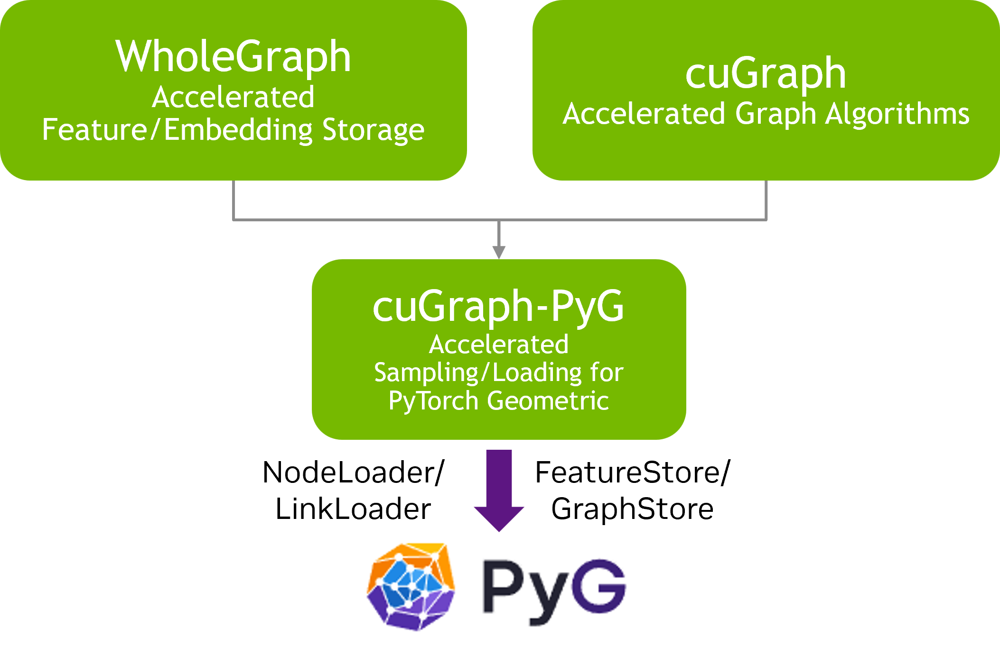

============================
Graph Neural Network Support
============================

**cuGraph-DGL has been removed from cuGraph GNN as of release 25.06.** We recommend migrating to 
cuGraph-PyG, which offers the same functionality along with additional features like support for heterogeneous sampling and a unified API. 
The cuGraph team is not planning any further work in the DGL ecosystem going forward.

----

The cuGraph GNN stack

----

Here is a talk that explains `Training GNNs at Internet Scale using cuGraph and WholeGraph <https://www.youtube.com/watch?v=rS-bcWm3jQo&t=2762s>`_

.. toctree::
   :maxdepth: 2

   PyG_support.md
   wholegraph_support.md

Blogs to explain how RAPIDS cuGraph supports GNN'S
==================================================
  * `Optimizing Memory and Retrieval for Graph Neural Networks with WholeGraph, Part 1 <https://developer.nvidia.com/blog/optimizing-memory-and-retrieval-for-graph-neural-networks-with-wholegraph-part-1/>`_
  * `Getting Started with Large-Scale GNNs using cuGraph Packages for DGL and PyG <https://www.nvidia.com/en-us/on-demand/session/gtc24-dlit61291/?playlistId=playList-108242b0-35ac-4765-9796-d6961cb026c4>`_

