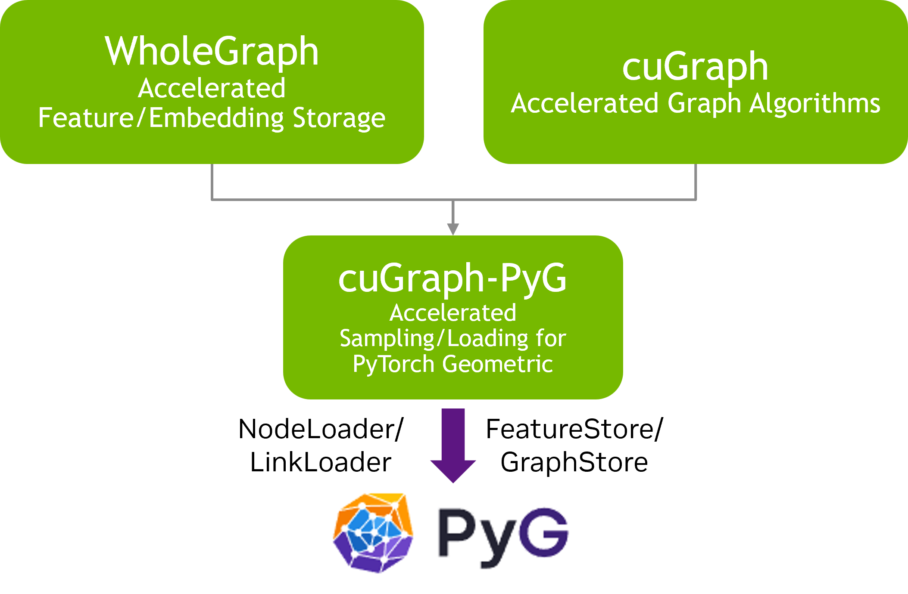

============================
Graph Neural Network Support
============================

The cuGraph GNN stack

----

Here is a talk that explains `Training GNNs at Internet Scale using cuGraph and WholeGraph <https://www.youtube.com/watch?v=rS-bcWm3jQo&t=2762s>`_

.. toctree::
   :maxdepth: 2

   PyG_support.md
   wholegraph_support.md

Resources for RAPIDS cuGraph GNN support
========================================
  * `Optimizing Memory and Retrieval for Graph Neural Networks with WholeGraph, Part 1 <https://developer.nvidia.com/blog/optimizing-memory-and-retrieval-for-graph-neural-networks-with-wholegraph-part-1/>`_
  * `https://blogs.nvidia.com/blog/ai-blueprint-fraud-detection/ <https://blogs.nvidia.com/blog/ai-blueprint-fraud-detection/>`_
