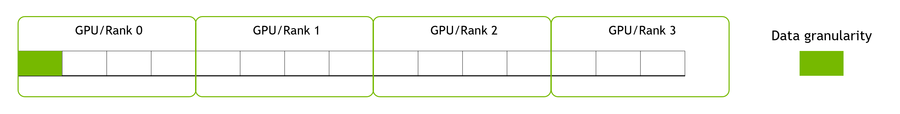
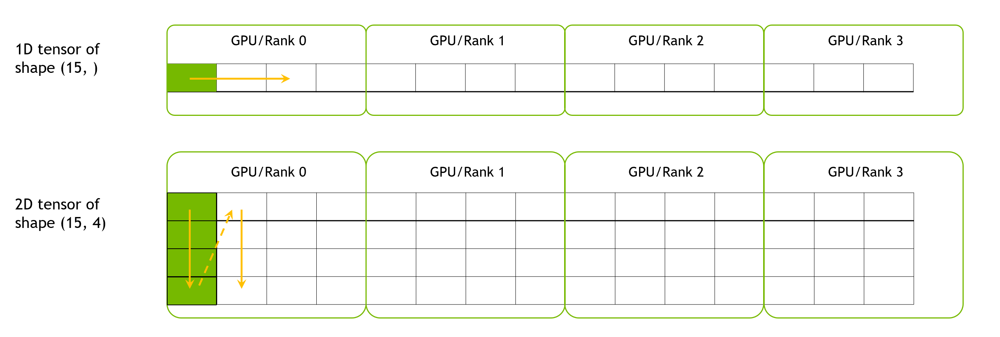
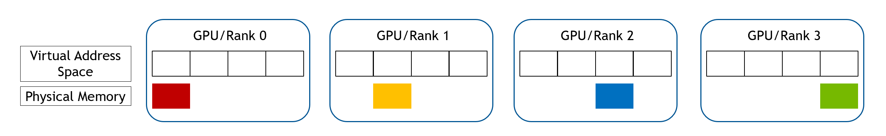
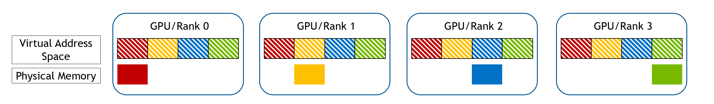
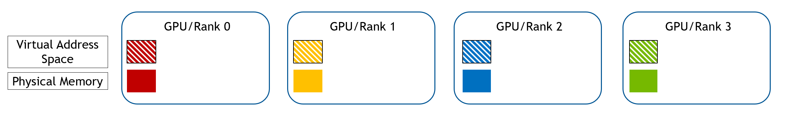
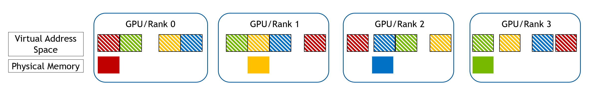
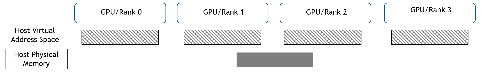
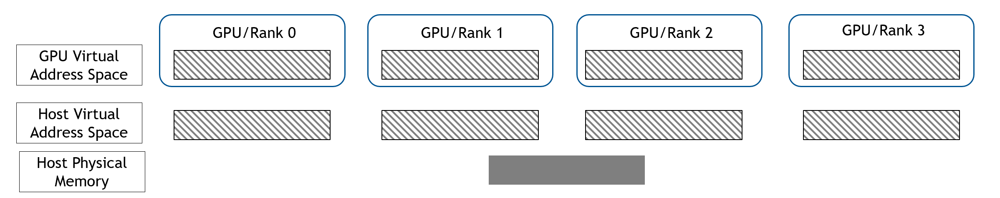
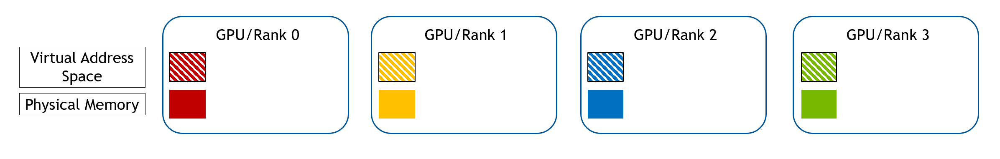

# WholeMemory implementation details

WholeMemory has two storage locations and four address-mapping types. Not every
combination is supported by every communicator, topology, CUDA version, and
communication backend. Use
`wholememory_communicator_support_type_location` before selecting a
configuration.

| Type | Location | Allocation | Mapping |
|:-----|:---------|:-----------|:--------|
| Continuous | Device | Each rank | One continuous device virtual-address range |
| Continuous | Host | Shared pinned host allocation | One continuous mapped range |
| Chunked | Device | Each rank | One CUDA IPC-mapped chunk per rank |
| Chunked | Host | Shared pinned host allocation | One mapped chunk per rank |
| Distributed | Device or host | Each rank | Only the local partition is mapped |
| Hierarchy | Device or host, when supported | Each rank | Local and cross-communicator hierarchy |

Continuous and chunked allocations are mapped allocations. Distributed
allocations rely on explicit communication for non-local data. Hierarchy
allocations divide communication into local and cross groups so operations can
use topology-aware paths.

## WholeMemory Layout

Because one WholeMemory object can span several GPUs, WholeGraph partitions it
across communicator ranks. Each rank owns one continuous portion of the
allocation. The portion can reside in device memory, pinned host memory, or a
peer-accessible device allocation. A caller can specify data granularity so a
logical record is never split between partitions.

The following figure shows 15 data blocks distributed over four GPUs.

WholeMemory tensor descriptions support up to eight dimensions in 26.10. The
first dimension is partitioned across ranks. The following two-dimensional
example uses one row as its data granularity:

## WholeMemory Allocation

The following sections describe the allocation process for the supported
memory-type and location combinations.

### Device Continuous WholeMemory

For device continuous WholeMemory, a virtual-address range covering the entire
allocation is first reserved on each GPU. Each GPU then allocates its physical
portion:

Each GPU exchanges memory handles and maps every portion into the reserved
address range:

### Device Chunked WholeMemory

For device chunked WholeMemory, each GPU allocates its local portion with the
CUDA runtime:

Each GPU exchanges CUDA IPC handles and maps one chunk for every peer:

### Host Mapped WholeMemory

Host continuous and host chunked allocations use the same shared pinned-memory
allocation:

Each rank then registers the host allocation in its GPU address space:

### Distributed WholeMemory

For distributed WholeMemory, each GPU allocates only its local portion. Remote
access uses explicit communication.

### Hierarchy WholeMemory

Hierarchy WholeMemory creates a local communicator for ranks in the same
topology domain and a cross communicator between domains. Gather operations can
route indices and data through those two levels. Capability and backend
restrictions are exposed by the 26.10 API and should be checked at runtime.
